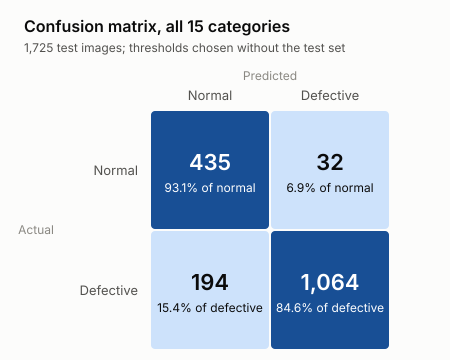
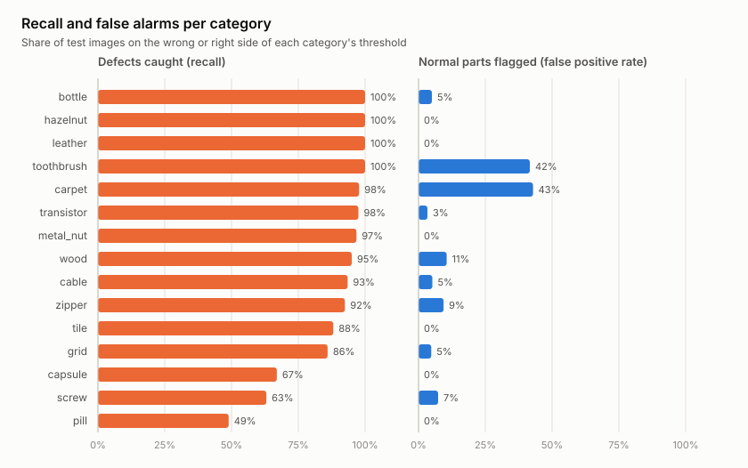
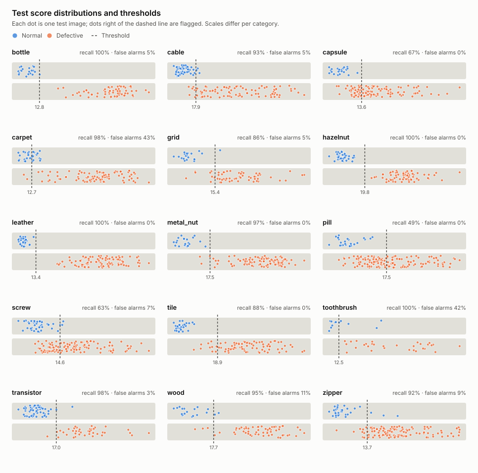

# `is_anomaly` eşiği — 2026-10-04

## Sorun

Servis şimdiye kadar yalnızca bir anomali puanı döndürüyordu. Bir kullanıcı için
"puan 17,9" tek başına bir şey söylemez; "bu parça kusurlu mu?" sorusunun cevabı
için her kategoriye bir eşik gerekir: puan eşiğin üstündeyse kusurlu, değilse sağlam.

Eşik, puanların ölçeği kategoriden kategoriye değiştiği için tek bir sayı olamaz.
Örneğin sağlam `hazelnut` görüntülerinin puanı 17 civarındayken sağlam `zipper`
görüntülerinin puanı 10 civarındadır.

## Yöntem

MVTec AD'de doğrulama kümesi yoktur ve eşik test kümesine bakılarak seçilirse
sonuç iyimser olur. Bu yüzden eşik yalnızca eğitim kümesinin sağlam görüntüleriyle
seçildi:

1. Her kategorinin sağlam eğitim görüntüleri seed 42 ile karıştırıldı ve %20'si
   ayrıldı (en az 1 görüntü, yukarı yuvarlanarak).
2. Kalan %80 ile, canlıdaki bankayla aynı ayarlarda yeni bir banka kuruldu
   (coreset, 16.384 patch, `neighborhood=3`, `border=2`, izdüşüm seed 42).
3. Ayrılan görüntüler bu bankayla puanlandı. **Eşik, bu puanların en yükseğidir.**
   Yani ayrılan sağlam görüntülerin hiçbiri kusurlu sayılmaz.
4. Eşik, canlıdaki (%100 ile kurulmuş) bankaya uygulanır. Test kümesi yalnızca bu
   noktadan sonra, sonucu raporlamak için kullanıldı; eşik ona göre değiştirilmedi.

Karar kuralı: `anomaly_score > threshold` ise `is_anomaly = true`.

%80 ve %100 bankalarının puanları neredeyse aynıdır. `toothbrush`'ta iki banka
aynı 42 test görüntüsünün çoğuna 0,5'ten az farkla puan verdi (ör. 19,3 ve 19,2);
en büyük fark 1,0 oldu (20,7 ve 19,7). Bu yüzden
%80 bankasından bulunan eşiği %100 bankasına uygulamak makul bir yaklaşımdır.

## Sonuçlar

Recall: kusurlu test görüntülerinin yakalanan oranı. Yanlış alarm: sağlam test
görüntülerinin kusurlu sayılan oranı. Image AUROC, [kenar raporundaki](border_exclusion.md)
resmi koşudandır ve eşikten bağımsızdır.

| Kategori | Ayrılan sağlam | Eşik | Recall | Yanlış alarm | Kaçan / kusurlu | Yanlış alarm / sağlam | Image AUROC |
| --- | ---: | ---: | ---: | ---: | ---: | ---: | ---: |
| bottle | 42 | 12,82 | 1,000 | 0,050 | 0 / 63 | 1 / 20 | 1,0000 |
| cable | 45 | 17,94 | 0,935 | 0,052 | 6 / 92 | 3 / 58 | 0,9921 |
| capsule | 44 | 13,60 | 0,670 | 0,000 | 36 / 109 | 0 / 23 | 0,9733 |
| carpet | 56 | 12,72 | 0,978 | 0,429 | 2 / 89 | 12 / 28 | 0,9819 |
| grid | 53 | 15,42 | 0,860 | 0,048 | 8 / 57 | 1 / 21 | 0,9758 |
| hazelnut | 79 | 19,80 | 1,000 | 0,000 | 0 / 70 | 0 / 40 | 1,0000 |
| leather | 49 | 13,41 | 1,000 | 0,000 | 0 / 92 | 0 / 32 | 1,0000 |
| metal_nut | 44 | 17,47 | 0,968 | 0,000 | 3 / 93 | 0 / 22 | 0,9985 |
| pill | 54 | 17,55 | 0,489 | 0,000 | 72 / 141 | 0 / 26 | 0,9444 |
| screw | 64 | 14,60 | 0,630 | 0,073 | 44 / 119 | 3 / 41 | 0,9250 |
| tile | 46 | 18,87 | 0,881 | 0,000 | 10 / 84 | 0 / 33 | 0,9996 |
| toothbrush | 12 | 12,47 | 1,000 | 0,417 | 0 / 30 | 5 / 12 | 0,9194 |
| transistor | 43 | 16,96 | 0,975 | 0,033 | 1 / 40 | 2 / 60 | 0,9954 |
| wood | 50 | 17,72 | 0,950 | 0,105 | 3 / 60 | 2 / 19 | 0,9868 |
| zipper | 48 | 13,69 | 0,924 | 0,094 | 9 / 119 | 3 / 32 | 0,9632 |
| **Toplam** | | | **0,846** | **0,069** | **194 / 1.258** | **32 / 467** | |

Toplam satırı bütün test görüntülerini birlikte sayar (makro ortalama değildir).
Bütün test görüntülerinde doğru karar oranı 0,869'dur.

<picture>
  <source media="(prefers-color-scheme: dark)" srcset="figures/threshold_confusion_dark.svg">
  
</picture>

<picture>
  <source media="(prefers-color-scheme: dark)" srcset="figures/threshold_rates_dark.svg">
  
</picture>

Aşağıdaki grafikte her nokta bir test görüntüsüdür; kesikli çizgi kategorinin eşiğidir.
Kategorilerin puan ölçekleri farklı olduğu için her panelin kendi ekseni vardır.

<picture>
  <source media="(prefers-color-scheme: dark)" srcset="figures/threshold_scores_dark.svg">
  
</picture>

## Yorum

- **Altı kategoride sonuç iyi:** `bottle`, `hazelnut`, `leather`, `metal_nut`,
  `transistor` ve `cable`'da kusurların %93'ünden fazlası yakalanıyor, yanlış alarm
  %5 civarında veya altında.
- **Kaçırılan kusurlar (`pill` 0,489, `screw` 0,630, `capsule` 0,670):** Bu
  kategorilerde yanlış alarm neredeyse yok, ama küçük kusurların çoğu eşiğin altında
  kalıyor. AUROC yüksek olduğu için (`pill` 0,94, `capsule` 0,97) puanların sıralaması
  iyi; sorun eşiğin yerinde. Eşik "ayrılan en yüksek sağlam puan" olduğu için
  temkinlidir ve küçük kusurları sağlam sayar.
- **Yanlış alarmlar (`carpet` 0,429, `toothbrush` 0,417):** Test kümesindeki bazı
  sağlam görüntüler, ayrılan sağlam eğitim görüntülerinin hepsinden yüksek puan aldı.
  `toothbrush`'ta yalnızca 12 görüntü ayrılabildi; bu kadar az görüntüyle puan
  dağılımının üst ucu iyi kestirilemez. Test kümesindeki iki sağlam görüntü 18,5 ve
  19,2 puan aldı; bunlar kusurlu görüntülerin çoğuyla aynı aralıkta. `carpet`'te
  56 görüntü ayrılmasına rağmen yanlış alarm yüksek; bu, test kümesindeki sağlam
  halıların eğitim kümesindekilerden biraz farklı olduğuna işaret ediyor olabilir.
  Bu ihtimal ayrıca incelenmedi.

Kısacası tek bir kural her kategoride aynı dengeyi kurmuyor: bazı kategorilerde
temkinli, bazılarında fazla hassas. Kaçan kusurla yanlış alarm arasındaki tercih
bir iş kararıdır (bir kusuru kaçırmak mı daha pahalı, sağlam parçayı atmak mı?).
Bu rapor bu tercihi yapmaz; yalnızca, test kümesine bakmadan seçilmiş tek bir
kuralın sonucunu gösterir.

## Ek inceleme: "en yüksek puan" kuralı aykırı değere hassas

**`pill`:** Eşik 17,55, ama test kümesindeki en yüksek sağlam puan 16,21. Ayrılan 54
sağlam eğitim görüntüsünün puanları tek tek incelendi: en yüksek sekizi 14,81, 14,83,
14,88, 14,91, 15,00, 15,28, 15,46 ve **17,55**. Eşiği tek bir görüntü
(`data/data_15/182-5.png`) belirliyor; ondan sonraki en yüksek puan 15,46. Bu
görüntüde, "F" harfinin yanında diğer beneklerden belirgin biçimde büyük kırmızı bir
benek var; puanın bu bölgeden gelip gelmediği ayrıca incelenmedi. Test kümesindeki
bütün sağlam görüntülerin altında kalan en yüksek eşik (16,21) kullanılsaydı, yine hiç
yanlış alarm olmadan recall 0,49 yerine 0,71 olurdu. Bu değer test kümesine bakılarak
bulunduğu için bir eşik önerisi değildir; yalnızca kuralın bu kategoride ne kadar
kaybettirdiğini gösterir.

`pill`'de kaçan kusurlar daha çok ince olanlardır:

| Kusur tipi | Yakalanan / toplam |
| --- | ---: |
| `pill_type` | 9 / 9 |
| `combined` | 13 / 17 |
| `contamination` | 13 / 21 |
| `scratch` | 14 / 24 |
| `color` | 11 / 25 |
| `faulty_imprint` | 4 / 19 |
| `crack` | 5 / 26 |

**`toothbrush`:** %100 recall yanıltıcıdır. Eşik (12,47), test kümesindeki sağlam
görüntülerin ortanca puanına (11,99) çok yakın. Hiç yanlış alarm vermeyen bir eşikte
recall 0,57 olurdu. Recall tek başına okunmamalı; yanlış alarm oranıyla birlikte
okunmalıdır.

İki durum aynı zayıflığı gösterir: en yüksek değer, az sayıda örnekte (`toothbrush`, 12
görüntü) puan dağılımının üst ucunu kaçırıp eşiği düşük bırakabilir; tek bir aykırı
örnekte (`pill`) ise eşiği gereğinden yukarı itebilir. Aykırı değerlere daha dayanıklı
kurallar (ör. ortalama + 3 standart sapma, bir yüzdelik veya k-katlı bölme) MLflow ile
ayrı deneyler olarak karşılaştırılmalı (aşağıdaki bölüme bakın). Kural, test sonuçlarına bakılarak değil,
önceden yazılmış bir gerekçeyle seçilmelidir.

## Kural karşılaştırması: max ve medyan + k·MAD — 2026-10-04

**Soru:** Aykırı değerlere dayanıklı bir kural (medyan + k·MAD) `pill` gibi kategorilerde
eşiği düzeltip genel sonucu iyileştirir mi?

**Protokol** (sonuçlara bakmadan önce [`scripts/modeling/compare_threshold_rules.py`](../scripts/modeling/compare_threshold_rules.py)
içine yazıldı):

- Adaylar: şu anki `max` kuralı ve `medyan + k · 1,4826 · MAD`, k ∈ {2, 3, 4, 5, 6}.
  1,4826 çarpanı, MAD'i normal dağılımda standart sapmayla aynı ölçeğe getirir. Hepsi
  aynı ayrılan sağlam eğitim puanlarını kullanır.
- Her kategorinin test görüntüleri, sağlam ve kusurlu ayrı ayrı olmak üzere ikiye
  bölündü (seed 42). Adaylar yalnızca **doğrulama** yarısında yarıştı.
- Kazanan: 15 kategorinin ortalama balanced accuracy'si en yüksek aday. Eşitlikte
  daha temkinli kural (büyük k; en temkinlisi `max`).
- Bütün kategoriler için tek bir k seçildi. Kategori başına k seçmek, bazı
  kategorilerde yalnızca 6 sağlam doğrulama görüntüsü olduğu için ezbere açıktı.
- Kazanan ve şu anki kural, **final** yarısında bir kez ölçüldü.

Balanced accuracy = (recall + sağlamları doğru tanıma oranı) / 2. Her aday MLflow'daki
`threshold-rules` deneyinde ayrı bir run olarak kayıtlıdır.

**Doğrulama yarısı:**

| Kural | Balanced accuracy | Recall | Yanlış alarm |
| --- | ---: | ---: | ---: |
| **max** | **0,890** | 0,847 | 0,076 |
| medyan + 2·MAD | 0,885 | 0,929 | 0,157 |
| medyan + 3·MAD | 0,884 | 0,872 | 0,102 |
| medyan + 4·MAD | 0,879 | 0,799 | 0,051 |
| medyan + 5·MAD | 0,865 | 0,746 | 0,034 |
| medyan + 6·MAD | 0,843 | 0,684 | 0,025 |

**Sonuç:** `max` kazandı; canlıdaki eşikler değişmedi. Final yarısında `max`: balanced
accuracy 0,907, recall 0,845, yanlış alarm 0,061.

**Neden?** Kategori bazında (doğrulama yarısı, balanced accuracy):

| Kategori | max | medyan + 2·MAD | medyan + 3·MAD | medyan + 4·MAD |
| --- | ---: | ---: | ---: | ---: |
| pill | 0,718 | **0,894** | 0,782 | 0,697 |
| capsule | 0,873 | **0,964** | 0,936 | 0,864 |
| grid | 0,897 | **0,966** | 0,862 | 0,776 |
| transistor | **0,958** | 0,833 | 0,917 | **0,958** |
| wood | **0,950** | 0,850 | 0,900 | 0,900 |
| carpet | 0,714 | 0,643 | 0,679 | **0,857** |

MAD beklendiği gibi `pill`'deki tek aykırı görüntünün etkisini kaldırdı (0,718 → 0,894).
Ama sağlam puanların sağa çarpık dağıldığı kategorilerde (`transistor`, `wood`) dağılımın
ortasına bakarak eşiği fazla sıkı koydu ve yanlış alarmları artırdı. Her k bazı
kategorilere iyi, bazılarına kötü geldi; ortalamada hiçbiri `max`'ı geçemedi.

Bu sonuç `pill` sorununun basit bir kural değişikliğiyle çözülmediğini gösterir. Daha
umut verici yollar: daha fazla kalibrasyon verisi (k-katlı bölme) veya ince kusurları
daha iyi gören bir model (ör. daha yüksek çözünürlük).

Bu karşılaştırma için kalibrasyon yeniden çalıştırıldı ve ayrılan puanlar
`thresholds.json`'a `holdout_scores` olarak eklendi; eşikler ilk koşuyla birebir aynı
çıktı. Test yarılarını, kuralları ve MLflow kaydını üretmek için:

```sh
.venv/bin/python -m scripts.modeling.calibrate_thresholds --device mps
.venv/bin/python -m scripts.reporting.plot_threshold_results          # test_scores.json
.venv/bin/python -m scripts.modeling.compare_threshold_rules --write  # --write yalnızca kazanan max değilse yazar
```

## Sınırlar

- Ayrılan küme küçüktür (12–79 görüntü). En yüksek değer, puan dağılımının üst
  ucunu olduğundan düşük gösterir; daha büyük bir kalibrasyon kümesi veya
  k-katlı bölme daha kararlı bir eşik verirdi. 15 kategoride tam bir koşu M4'te
  yaklaşık 55 dakika sürdüğü için k-katlı bölme (yaklaşık 5 kat süre) denenmedi.
- Sonuçlar tek seed'e ve tek bir bölmeye dayanır.
- `border=2` test sonuçlarına bakılarak seçildiği için ([kenar raporu](border_exclusion.md)),
  test puanları bir miktar iyimser olabilir. Eşiğin kendisi test kümesine bakılmadan seçildi.

## Servis

[`scripts/modeling/calibrate_thresholds.py`](../scripts/modeling/calibrate_thresholds.py), bankaların
yanına iki dosya yazar:

- `thresholds.json`: kategori başına eşik ve kalibrasyon bilgisi. Servis bu dosyayı
  açılışta `MODEL_DIR`'dan okur ve `/predict` cevabına `threshold` ve `is_anomaly`
  ekler. Dosya yoksa ya da kategori dosyada yoksa iki alan da `null` olur.
- `threshold_evaluation.json`: yukarıdaki tablonun ham sayıları.

Canlı servis için `thresholds.json`, bankalarla aynı Cloud Storage bucket'ına kondu.

Kalibrasyon `bf1da8f` commit'i ve `scripts/modeling/calibrate_thresholds.py` ile 2026-10-04'te,
Apple MPS üzerinde yaklaşık 55 dakikada çalıştırıldı. `thresholds.json` SHA256:
`bd872203f8ccf8ede2ed641f7d6712558b894017afcbdada4eda7413c1f6c4ac`. Yeniden üretmek için:

```sh
.venv/bin/python -m scripts.modeling.calibrate_thresholds \
  --dataset-root data/mvtec-ad \
  --model-dir artifacts/border-exclusion/coreset-16384-n3-b2/patchcore \
  --holdout-fraction 0.2 --seed 42 --device mps
```

Grafikler [`scripts/reporting/plot_threshold_results.py`](../scripts/reporting/plot_threshold_results.py)
ile üretildi. Script, test puanlarını ilk çalıştırmada hesaplayıp bankaların yanına
`test_scores.json` olarak kaydeder ve `reports/figures/` altına açık ve koyu tema için
SVG yazar:

```sh
.venv/bin/python -m scripts.reporting.plot_threshold_results --device mps
```
